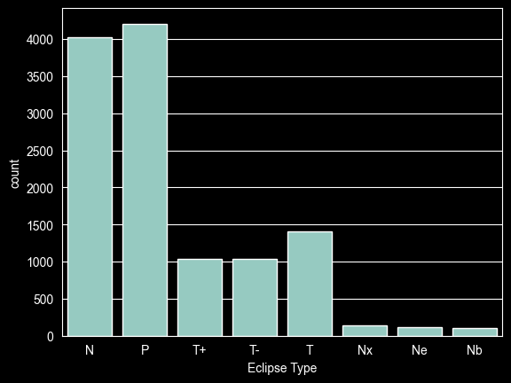

# eClipseBord

A fullstack lunar eclipse dashboard. A FastAPI service reads NASA's five-millennium
lunar eclipse catalogue and serves it as JSON; a Streamlit frontend consumes that API
and renders it. Both are packaged as Docker images and deployed to Azure Container Apps.


 

## Stacks

| Layer | Tech |
| --- | --- |
| Backend | FastAPI + pandas, served by uvicorn |
| Frontend | Streamlit + httpx |
| Packaging | uv workspace, two Docker images |
| Hosting | Azure Container Apps, images stored in Azure Container Registry |

## Dataset

12,064 lunar eclipses spanning the years -1999 to 3000, across 204 saros series.

| Category | Count |
| --- | --- |
| Partial | 4,207 |
| Penumbral | 4,020 |
| Total | 2,447 |
| Unknown | 1,390 |

The CSV lives at `backend/data/lunar.csv` and is loaded into a pandas DataFrame at
import time, so the API holds the whole catalogue in memory. `data_processing.py`
normalises the duration columns, derives a `Year` column from `Calendar Date`, and maps
the raw `Eclipse Type` codes (`N`, `P`, `T`, `T+`) onto readable categories.

## Run locally

This repo is a uv workspace with two members, `backend` and `frontend`. The workspace
root declares no dependencies of its own, so a plain `uv sync` installs nothing — use
`--all-packages`:

```bash
uv sync --all-packages
```

Backend, in one terminal:

```bash
uv run uvicorn backend.api:app --reload --port 8000
```

Frontend, in another:

```bash
uv run streamlit run frontend/src/frontend/dashboard.py
```

## Run with Docker

```bash
docker compose up --build
```
## API

### `GET /`

Status and row count.

```json
{"status": "success", "message": "Lunar APi is running", "eclipses": 12064}
```

### `GET /lunar/statistics`

Aggregate summary — total count, breakdown per category, year range, number of saros series.

### `GET /lunar/eclipses`

Paginated catalogue.

| Parameter | Type | Default | Notes |
| --- | --- | --- | --- |
| `category` | str | — | `Penumbral`, `Partial`, `Total`, `Unknown` (case-insensitive) |
| `year_from` | int | — | see Known issues |
| `year_to` | int | — | see Known issues |
| `saros` | int | — | saros series number |
| `limit` | int | 100 | between 1 and 100 |
| `offset` | int | 0 | |

Because `limit` is capped at 100, the dashboard pages through the full catalogue in
sequential requests and caches the result for 10 minutes (`st.cache_data(ttl=600)`).

## Project structure

```
.
├── backend/
│   ├── data/lunar.csv              eclipse catalogue
│   ├── src/backend/
│   │   ├── api.py                  FastAPI routes
│   │   ├── constants.py            dataset path
│   │   └── data_processing.py      load, clean, derive columns
│   └── pyproject.toml
├── frontend/
│   ├── src/frontend/dashboard.py   Streamlit app
│   └── pyproject.toml
├── dockerfiles/
│   ├── backend.dockerfile
│   └── frontend.dockerfile
├── docker-compose.yaml
├── eda_eclipse_data.ipynb          exploratory data analysis
└── pyproject.toml                  uv workspace root
```

